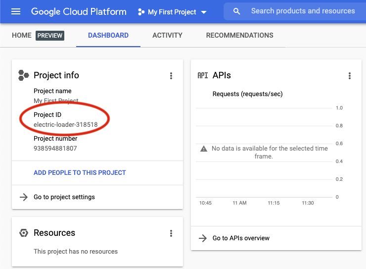
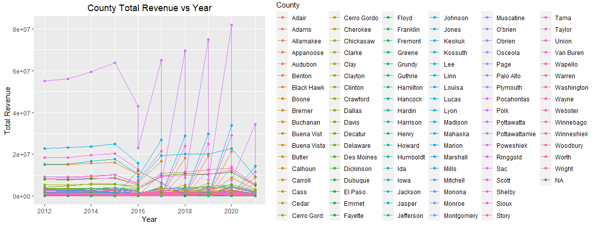
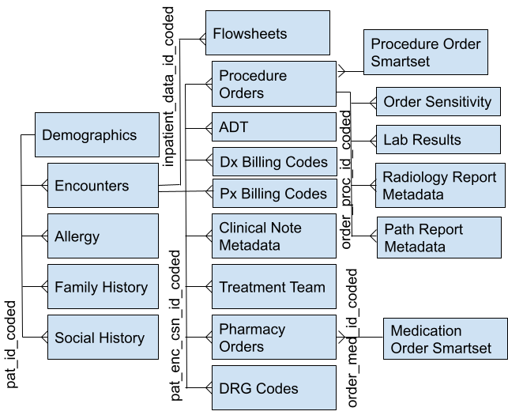

# Working with Google Cloud

The [STAnford Research Repository (STARR)](https://med.stanford.edu/starr-tools.html)
is the School of Medicine's project that supports all sorts of clinical 
research projects. There are lots of ways to get access to and use the data; the
best way for us is to use the R [BigQuery](https://cloud.google.com/bigquery/)
API. Our collaborator [Jonathon Chen](http://healthrexlab.com/) was kind enough
to add you to his IRB and give us access to Google Cloud Project.

We will be using a mix of [SQL](https://en.wikipedia.org/wiki/SQL) and R to
query STARR for deidentified EHR (and no PHI) to build a cohort of patients who
are likely to identify as trans* or non-binary. Then we can start summarizing
the trans* patient population seen at Stanford Health Systems *for the first
time (that I know of)!* We can also explore some ML clustering algorithms and
potentially expand our cohort, do some [propensity score
matching](https://en.wikipedia.org/wiki/Propensity_score_matching), and explore
issues of health equity for this community. These queries and cohort will be
essential for developing more inclusive data models for Sex and Gender as well
as algorithms that can label EHR with it to enable robust research that will
inform health policy.

## Contents

- [Perquisites](#perquisites)
- [STARR](#starr)
  - [Building queries](#building-queries)
  - [Results](#results)
- [Exploratory Data Analysis](#exploratory-data-analysis)

## Perquisites
If you don't already have a Google Cloud account, go to:
https://console.cloud.google.com/ and sign with any GSuite account and start a
free trial. Then follow the instructions 
[here](https://cloud.google.com/sdk/docs/install). You'll need Python, which 
shouldn't be a problem since it's nearly ubiquitous. Then click [this
link](https://console.cloud.google.com/apis/library/bigquery.googleapis.com?_ga=2.48078567.1138561114.1625088035-509917660.1611616658) 
and **enable** the BigQuery API.

Next we need to create an authentication key for Google Cloud. Call this next 
line of code from your terminal/command line.

```bash
gcloud auth application-default login
```
After you run the above line you should see something like `Credentials saved 
to file: [path/to/auth-key.json]` we'll need to use this later R can connect to
BigQuery.

Alright now were ready to start using the R BigQuery API in R. The features we
need are still in development so we'll install the API using the `devtools`
package (this might take a while if don't already have `devtools` installed). We
will also need to use the `tidyverse` packages, which is the sliced bread of 
data science IMHO.

```r
install.packages("tidyverse")
install.packages("devtools")
devtools::install_github("rstats-db/bigrquery")
```

Now lets do a quick check with a public dataset to make sure everything is
working before we get started with STARR.

The basic steps for using `bigrquery` are to:

0. Import the library
0. Declare Google Cloud Project ID and authentication key
0. Declare your SQL query as a string in R
0. Call execute your query and store it as a table

```r
## Step 0
library("tidyverse")
library("bigrquery")
```
Easy enough! 

Next we need our Project IDs, which we can find on the home page of 
http://console.cloud.google.com Project info.



```r
## Step 1
projectId <- "whatever-your-project-id-is"
authKey   <- "path/to/auth-key.json"
bq_auth(authPath)
```

For the next two steps were gonna use the [Iowa Liquor
Sales](https://data.iowa.gov/Sales-Distribution/Iowa-Liquor-Sales/m3tr-qhgy)
data set. It's just one table with about 3 million rows, which is pretty easy
to work with just with R, so BigQuery is a bit overkill for this task. STARR,
on the other hand, is a rather complicated [relational
database](https://en.wikipedia.org/wiki/Relational_database) with decades of
patient encounters, diagnostic tests, procedures, etc. and it's impossible to
work with it without SQL.

Now say we want to look at yearly trends in the revenue generated from alcohol
sales in each county. To do that, we `SELECT` the county, year, and `SUM` the
sales revenue variables and `GROUP BY` county and year. We can also tell SQL to
`ORDER BY` the new total revenue variable from high to low: `DESC` (descending
order).
```r
## Step 2
query <- "SELECT 
		county, EXTRACT(YEAR FROM date) AS year, SUM(sale_dollars) AS total_revenue
	  FROM
		`bigquery-public-data.iowa_liquor_sales.sales`
	  GROUP BY
		county, year
	  ORDER BY
		total_revenue DESC"

## Step 3
tb <- bq_project_query(projectId, query)
tb <- bq_table_download(tb)
tb
```

We have our table! It might be a little messy still but it'll be easier to
clean up using `tidyverse` tools than to do with our original SQL call. Try
making a line plot showing the trend of `total_revenue` over the years with a
line for each `county`. I'd suggest using `ggplot`. Make a pull request to push
your code in this directory and edit this file to add your plot on this page
(or you can use the Google Doc).



Sweet, hopefully that was painless. Now we can get started using STARR!

## STARR

To use STARR you need work though Stanford's VPN to protect your internet 
connection and data. Instructions for installing can be found 
[here](https://uit.stanford.edu/service/vpn). Be sure to log in with the "Full
Traffic non-split-tunnel" and make sure your network adapter is set to use
IPv4 (instead of IPv6).

MacOS:
- Go to Apple - > System Preferences -> Network
- Select the current network connection listed on the left-hand side, then
  click the Advanced button.
- Go to the TCP/IP tab at the top
- Beside "Configure IPv6", set it to "Link-local Only" and "Apply"

Windows Systems:
- Settings > Network & Internet
- Change Adapter Options
- Select your WiFi or Ethernet or other network connection device
- Properties
- Uncheck "Internet Protocol Version 6 (TCP/IPv6)"

We should be ready now!

### Building queries

In order to build queries for records of patients that likely identify as a 
gender minority, will need to know how the STARR database is structured. Here's
a diagram of the relationships between the tables:



If there's a relation between tables, there's a line that connects it and the
name of the variable that forms the connection. For example, this allows you to
merge rows in the *Demographics* table with the *Encounters* table with the
variable `pat_id_coded` and then merge that with the *Pharmacy Orders,
Procedure Orders, Clinical Note Metadata, etc.* tables with the
`pat_enc_csn_id_coded` variable. 

We will also need the names of the variables and the values that we want to use
for our queries. This can be found in the [data
dictionary](https://docs.google.com/spreadsheets/d/1nX5hxg4nHEYn6mFH7FbMLTahpe_nAGsrhVjXjMchVQc/edit?usp=sharing)
where each sheet in the Google Spreadsheet contains information about the 
variables that you'll need to form a query. In the sheets you will see the `PK`
or *Primary Key* for that table and `FK` or *Join Key* (idk what the F means) to
other tables. 

**General Guidance**
- *Start small*: Set a `LIMIT` of `100` rows to save on compute as you test
  and refine your queries
- *Add complexity*: Make sure you're getting the right intermediate results 
  before adding SQL summary operations, conditionals, and joining tables
- *Develop a workflow*: As with all things coding, there's countless ways of 
  accomplishing the same task. You may find you like to carry out summary 
  operations and joins with your SQL call or you my find it easier download more
  course table and then carry out the operations with `tidyverse` tools.

The actual name of the STARR database we'll be using is `starr_datalake2018`. 
Lets try a test run to see everything works.

```r
library("tidyverse")
library("bigrquery")
projectId = "mining-clinical-decisions"		# This shouldn't change
authPath  = "path/to/auth-key.json"		# Change this 
bq_auth(authPath)

demographic_query = "SELECT 
			*
		     FROM
			starr_datalake2018.demographic
		     LIMIT
			100
		    " 
demographic_table = bq_project_query(projectId, demographic_query) %>%
	bq_table_download()
demographic_table
```

Okay now lets try something a little more complicated and do what's called a 
subquery. At a high level, you can run a query to make a table, wrap it in 
parenthesis, and then query off that. In this example, I'm going to look for 
distinct patients that were seen for a `History` appointment and then I'm going
to create indicator variable for their assigned sex at birth and race/ethnicity.


```r
hist_query = "SELECT
                DISTINCT rit_uid,
                CASE WHEN gender = 'Male' THEN 1 ELSE 0 END AS males,
		CASE WHEN gender = 'Female' THEN 1 ELSE 0 END AS females,
        	CASE WHEN canonical_race LIKE '%Asian%' THEN 1 ELSE 0 END AS asians,
		CASE WHEN canonical_race LIKE '%Black%' THEN 1 ELSE 0 END AS blacks,    
	        CASE WHEN canonical_race LIKE '%Pacific%' THEN 1 ELSE 0 END AS pacific_islanders,
        	CASE WHEN canonical_race LIKE '%White%' THEN 1 ELSE 0 END AS whites,
		CASE WHEN canonical_race LIKE '%Other%' THEN 1 ELSE 0 END AS race_other,
        	CASE WHEN canonical_race LIKE '%Unknown%' THEN 1 ELSE 0 END AS race_unknown,
		CASE WHEN canonical_ethnicity LIKE 'Hispanic%' THEN 1 ELSE 0 END AS hispanic
              FROM
                starr_datalake2018.demographic
              WHERE rit_uid IN
              ( SELECT DISTINCT
                  jc_uid
                FROM 
                  starr_datalake2018.encounter
                WHERE appt_type = 'History'
                LIMIT 100
              )
             "

hist_table = bq_project_query(projectId, hist_query) %>%
  bq_table_download()
hist_table
```

Okay but let's say I want to keep some variables from both tables instead of 
just conditioning on a other table. For that we can use a `JOIN` command or 
a merge operation. With this query I'm going to try to find patients assigned 
Female at birth who were diagnosed with Gender Dysphoria and I want to summarize
how they are insured but I want to use `dplyr` instead of SQL.

```r
gender_dys_query = "SELECT
                      dem.rit_uid,
                      dem.gender,
                      dem.insurance_payor_name,
                      dx.icd10
                    FROM
                      starr_datalake2018.demographic as dem LEFT JOIN
                      starr_datalake2018.diagnosis_code as dx ON dem.rit_uid = jc_uid
                    WHERE dem.gender = 'Female'
                    AND dx.icd10 = 'F64.2'
                  "
gender_dys_table = bq_project_query(projectId, gender_dys_query) %>%
  bq_table_download()
gender_dys_table %>% mutate(public_insurance = ifelse(is.na(insurance_payor_name), NA, insurance_payor_name %in% c("MEDICAID", "MEDICARE"))) %>% 
    group_by(public_insurance) %>% 
    summarise(n = n())
```

Awesome, hopefully that's all you need to get started!

### Results

Alright, now that you've got what you need to get started it's your turn to 
start building queries. Think of of the ways we might find people how are 
likely to identify as a gender minority. Diagnosis codes are one way but they
can be unreliable. Medical treatments and surgical procedures are another way.

Deliverables
- A list of strategies you used and a brief justification
- R code for your queries (please push to this repo).
- Basic counts for the number of number of unique individuals you're able to
  find with each query

## Exploratory Data Analysis

*(Coming soon!)*
